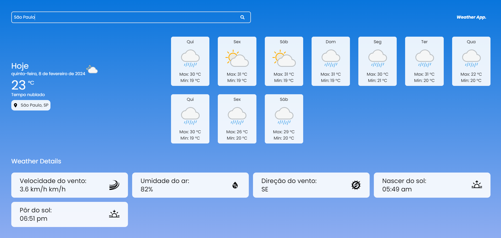

<h1>Weather app com Next js. ☀</h1>

<h3>Preview do projeto:</h3>

<h3>Descrição:</h3>

Projeto desenvolvido com Next.Js e TailwindCSS, consumindo uma api externa e disponibilizando para o usuário, a região pesquisada, o clima atual, o clima dos próximos 11 dias e alguns detalhes sobre o clima do dia, como por exemplo: <strong>Velocidade do vento, umidade do ar, direção do vento, nascer do sol e pôr do sol.</strong> Você pode acessar o projeto diretamente, clicando (Aqui)[https://weatherapp-next-js.vercel.app/] 

